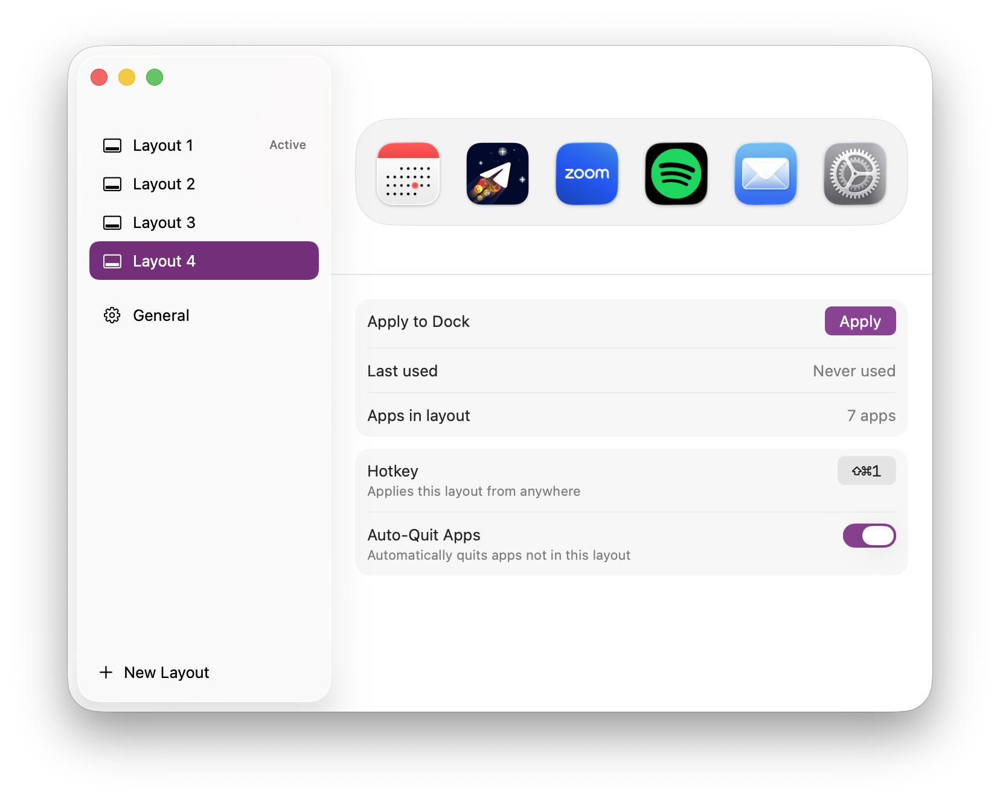

# Shitsurae



A macOS app that saves your Dock as named layouts and switches between them from
the menu bar, from the settings window, or with a global hotkey. It lives in the
menu bar alone: no Dock tile, no ⌘Tab slot. The settings window is opened from
the menu.

*Shitsurae* (しつらえ) is the Japanese practice of arranging a space for the
occasion at hand. Work, personal, screen sharing — each gets its own Dock.

## What it does

- **Save the current Dock** as a named layout: its apps, their order, and the
  Dock's own settings — position, tile size, magnification and its size,
  auto-hide, and whether recent applications are shown.
- **Switch layouts** from the menu bar, or bind a global hotkey to each one.
- **Optionally quit what you left behind.** With Auto-Quit on for a layout,
  applying it asks the applications outside it to quit — politely, so anything
  with unsaved work can still stop you.
- **Edit a layout in place** — drag tiles to reorder, drop an app from Finder to
  add it, remove one from the tile's context menu.

On first launch Shitsurae saves whatever is in your Dock as a layout called
`Dock 1`, so applying it later puts the Dock back the way you found it. It also
tells you plainly whether a failure left your Dock alone or already changed it.

## Requirements

- macOS 26 (Tahoe) or later
- Apple Silicon
- Xcode 26 or later to build

## Installing

Each release on the [Releases](https://github.com/LilMikazuki/Shitsurae/releases)
page is a zip archive holding `Shitsurae.app`. Unzip it and move the app to
`Applications`.

The app is signed ad hoc and not notarized, so Gatekeeper stops the first launch:
macOS says it cannot verify the app and offers to move it to the Bin. Close that
dialog, open System Settings → Privacy & Security, scroll to the line about
Shitsurae and click **Open Anyway**. Or clear the quarantine flag once:

```bash
xattr -d com.apple.quarantine /Applications/Shitsurae.app
```

Shitsurae asks for no permissions — no Accessibility, no Automation — and never
uses the network. To build it from source instead, see [Building](#building).

## Getting around

Shitsurae has three places: the menu, the save dialog and the settings window.

**The menu** drops from the icon at the right of the menu bar. It lists your
layouts, with a checkmark on the one your Dock holds now and each layout's
hotkey beside its name, then *Save Current Dock as Layout…*, *Settings…* and
*Quit Shitsurae*. Clicking a layout applies it: the Dock blinks once and comes
back rearranged.

**The save dialog** asks for a name and suggests `Layout N`. Return saves, Esc
cancels; an empty name, or one already taken, is refused with a reason.

**The settings window** is a sidebar and a page.

- The sidebar lists the layouts, with an *Active* badge on the applied one, a
  *General* row at the bottom and *New Layout* under the list. Arrow keys move
  the selection and Return renames; right-click a layout for *Apply*, *Rename*
  and *Delete*.
- A layout's page starts with the Dock strip: drag a tile to reorder, right-click
  it for *Move Left*, *Move Right* and *Remove from Layout*, press the `+` tile
  to pick applications, or drop them in from Finder. An application that is no
  longer on disk is dimmed with a dashed border and left out when the layout is
  applied. Below the strip: *Apply to Dock*, when the layout was last used, how
  many apps it holds, the *Hotkey* pill and the *Auto-Quit Apps* switch.
- The hotkey pill records on click: press a combination with ⌘ or ⌥ and release
  the keys to save it; ⌫ clears, Esc cancels. A combination another layout
  already uses names that layout instead of taking it over. Right-click the pill
  to clear the shortcut.
- *General* holds *Launch at login*, the folder your layouts live in, and the
  version.

A hotkey applies its layout from any application, with the settings window open
or not.

## Building

```bash
brew install xcodegen swiftformat
xcodegen generate
xcodebuild -project Shitsurae.xcodeproj -scheme Shitsurae -configuration Debug build
```

The logic lives in a Swift package that builds and tests on its own:

```bash
swift test --package-path ShitsuraeCore
```

## Layout of the repository

| Path | What lives there |
| --- | --- |
| `Shitsurae/` | The app target: SwiftUI views, the menu bar scene, alert presentation. |
| `ShitsuraeCore/Sources/ShitsuraeCore/` | Reading and writing `com.apple.dock`, restarting the Dock. Knows nothing about layouts. |
| `ShitsuraeCore/Sources/ShitsuraeKit/` | Layout storage, services, `AppModel`. Platform-aware, UI-free. |
| `ShitsuraeCore/Sources/shitsurae-cli/` | A debugging CLI for the core. |
| `Design/` | The app icon and the script that builds it. |

The dependency direction is one-way: the app depends on the kit, the kit depends
on the core, and nothing depends on the app.

`ShitsuraeCore` is the part worth reusing on its own — it reads and writes the
Dock's preferences domain and restarts the Dock, and knows nothing about
layouts. `ShitsuraeKit` exists for this app: it is a Swift package target
only because the app is a separate module, its public symbols are public for
that reason alone, and its shape will follow the app rather than any outside
consumer.

### Where your data lives

- Layouts: `~/Library/Application Support/Shitsurae/layouts`, one JSON file each,
  so they can be copied between machines. A file copied in under any name is
  picked up the next time the settings window is opened, or at the next launch,
  and renamed after the layout's id. A second file holding a layout that is
  already there is skipped and named in the settings sidebar rather than shown
  twice.
- Hotkeys: in the app's preferences domain, not in the layout files — a layout
  copied to another machine deliberately brings no shortcuts with it.

### Diagnosing a problem

Shitsurae logs what it does and every failure it meets to the unified log, under
the subsystem `io.github.lilmikazuki.Shitsurae`. To see the last hour:

```bash
log show --last 1h --predicate 'subsystem == "io.github.lilmikazuki.Shitsurae" AND process == "Shitsurae"'
```

or, to watch it live while reproducing something:

```bash
log stream --predicate 'subsystem == "io.github.lilmikazuki.Shitsurae" AND process == "Shitsurae"'
```

The `process` clause keeps the test suite out: `swift test` builds layout stores and
models that log through the same subsystem, and without it a run adds over a hundred
lines to what you are reading.

Layout names never appear there — a layout is identified by its id, which is also
its file name. Paths, bundle ids, Dock keys and error descriptions do, so the
output is safe to read but worth a glance before pasting it into an issue.

## The CLI

`shitsurae-cli` exercises the core package without the app:

```
Usage: shitsurae-cli <command>

Commands:
  dump [--json]            Print the current Dock layout and settings;
                           --json prints a DockState JSON document instead
  apply <file> [--dry-run] Apply a DockState JSON file; --dry-run prints the
                           result without touching the real Dock
  --help, -h               Print this message
```

## Known limits

- Dock separators (`spacer-tile` and friends) are a real Dock feature that
  Shitsurae does not round-trip yet. Reading a Dock that contains one fails with
  a message that names the tile rather than corrupting it.
- Folders and documents pinned to the right-hand side of the Dock are not part
  of a layout yet.
- The minimize effect and other Dock preferences outside the seven keys above
  are left exactly as they are; switching layouts never touches them.
- Editing the layout that is currently applied does not re-apply it. The Dock
  keeps what it had, and the layout stops being marked as applied until you
  press Apply again.

## Contributing

The bar for this codebase is that the code explains itself. Comments are rare
and short, and only where a reader would otherwise "fix" something load-bearing.
Everything else is carried by names, types, and tests.

Before opening a pull request:

```bash
swiftformat --lint .
swift test --package-path ShitsuraeCore
```

## Releasing

A release is a tag. Set `CFBundleShortVersionString` in `Shitsurae/Info.plist`
to the new version, commit, then tag that commit `v<version>` and push the tag:

```bash
git tag v1.1 && git push origin v1.1
```

The [release workflow](.github/workflows/release.yml) refuses a tag that does
not match the version in `Info.plist`, runs the same checks as CI, builds the
app in Release, and publishes the zip and its SHA-256 on the Releases page.

## License

MIT — see [LICENSE](LICENSE).
